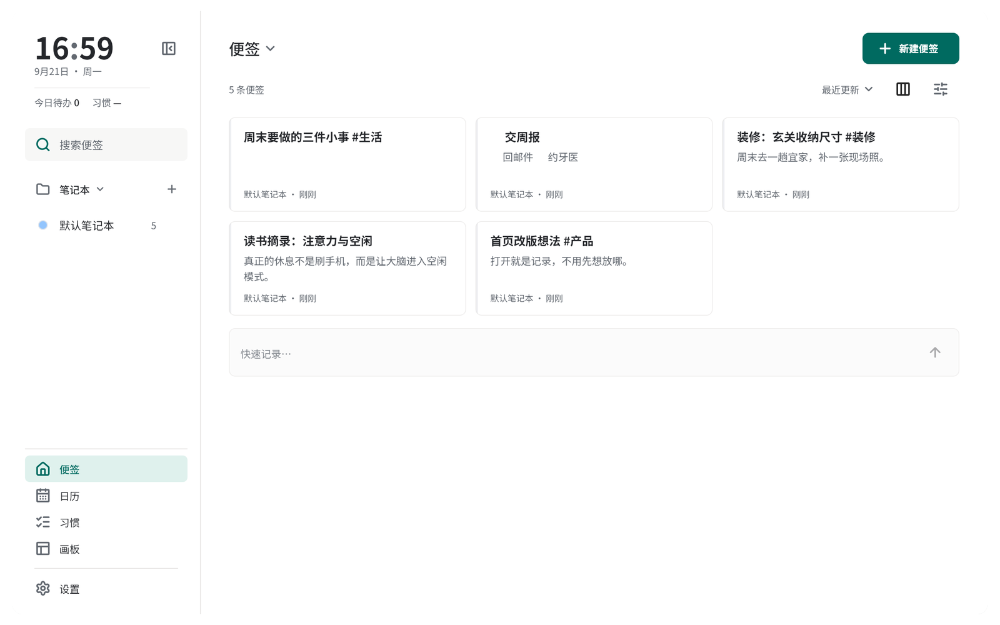

# Nibs 桌面版下载

Nibs 是一个桌面便签应用：便签、日历、习惯、画板都在同一个窗口里。数据保存在自己这台
设备上，要跨设备就接你自己的 WebDAV。



## 下载

### 👉 [打开最新版下载页](https://github.com/grobenis/Nibs_release/releases/latest)

那一页里按你的系统取一个文件：

| 你的系统                   | 取哪个文件                          | 多大     |
| -------------------------- | ----------------------------------- | -------- |
| Ubuntu 22.04 及以上（x64） | `sticky-notes-app_<版本>_amd64.deb` | 约 25 MB |
| Windows 10 / 11（x64）     | `Nibs-Setup-<版本>.exe`             | 约 27 MB |

同一页里还有个 `versions.json`，那是给应用内「检查更新」读的清单，下载时不用管它。

### Linux 怎么装

```bash
sudo dpkg -i sticky-notes-app_<版本>_amd64.deb
```

也可以双击这个文件，交给系统的「软件安装」。提示缺依赖时，先跑
`sudo apt-get -f install` 再装一次。装完在应用列表里搜 Nibs。

想一条命令直接抓最新版（需要 `jq`）：

```bash
curl -fsSLO "$(curl -fsSL https://github.com/grobenis/Nibs_release/releases/latest/download/versions.json | jq -r '.platforms["linux-x64"].url')"
```

### Windows 怎么装

双击 `Nibs-Setup-<版本>.exe`，按提示一路下一步。装完从开始菜单启动，安装时可以顺手
勾上桌面快捷方式。

安装包**没有代码签名**，Windows 的 SmartScreen 可能拦一下：点「更多信息 → 仍要运行」
就行。装的位置是 `%LOCALAPPDATA%\Programs\Nibs`，**不需要管理员权限**。

## 装完之后

- 应用里的「检查更新」能直接升到下一版（下载 → 校验 sha256 → 调系统安装器）。
- 不想在应用里升，就回到上面的下载页拿最新的安装包重装一遍。

## 给排障和内测的人

- 客户端读的固定地址（匿名可读，别改）：
  `https://github.com/grobenis/Nibs_release/releases/latest/download/versions.json`
- 版本号里的 `+N` 是构建号：同一个功能版本每构建一次加一，用来对上是哪一次构建。
- 清单字段的语义、发版流程见主仓库的 `RELEASE.md`（主仓库私有）。
- 主仓库（私有）：https://github.com/grobenis/Nibs

---

> **请勿手工改动这里的资产。** Release 由主仓库的 `.github/workflows/release.yml`
> 在推送 `v*` tag 时自动发布，下次发版会覆盖，而且客户端校验的 sha256 会对不上。
>
> **这个 README 请勿删除。** 本仓库必须**至少有一次提交**：GitHub 不允许在空仓库上
> 把 Release 定稿，接口会返回 `Repository is empty.`，Release 会永久停在草稿状态——
> 而草稿对匿名下载是不可见的，`releases/latest/download/` 也就永远 404。
>
> 这个仓库**不放代码**，只有构建产物和这一页说明用的截图。
